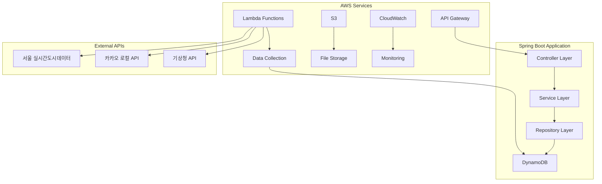

# 쉿플레이스 백엔드 개발 가이드

## 🎯 백엔드 아키텍처



## 📊 DynamoDB 테이블 설계

### Places Table
```
PK: place_id (String)
SK: METADATA
Attributes:
- name: 장소명
- latitude: 위도
- longitude: 경도
- geohash: GeoHash 값 (검색 최적화)
- category: 장소 카테고리
- address: 주소
- created_at: 생성일시
- updated_at: 수정일시
```

### NoiseData Table
```
PK: place_id (String)
SK: timestamp (String, ISO format)
Attributes:
- noise_level: 소음도 (dB)
- noise_score: 소음 점수 (1-10)
- traffic_volume: 교통량
- weather_condition: 날씨 상태
- data_source: 데이터 출처
```

### CrowdData Table
```
PK: place_id (String)
SK: timestamp (String, ISO format)
Attributes:
- crowd_density: 인구 밀도
- crowd_score: 혼잡도 점수 (1-10)
- subway_usage: 지하철 이용량
- bus_usage: 버스 이용량
- parking_usage: 주차장 이용률
```

## ⏰ 12시간 개발 타임라인

### 0-2시간: 프로젝트 초기 설정

```mermaid
gantt
    title 백엔드 초기 설정
    dateFormat HH:mm
    axisFormat %H:%M
    
    section 환경설정
    Spring Boot 프로젝트 생성    :done, setup1, 00:00, 00:30
    AWS SDK 설정               :done, setup2, 00:30, 01:00
    DynamoDB 로컬 설정          :done, setup3, 01:00, 01:30
    기본 패키지 구조 생성        :done, setup4, 01:30, 02:00
```


**작업 내용:**
- [ ] Spring Boot 3.x 프로젝트 생성 (Spring Initializr)
- [ ] 필수 의존성 추가 (AWS SDK, DynamoDB, Web, Validation)
- [ ] application.yml 설정 (AWS 리전, DynamoDB 설정)
- [ ] 패키지 구조 생성 (controller, service, repository, model, config)
- [ ] AWS 자격증명 설정 (IAM 역할 또는 액세스 키)

**핵심 파일:**
```
backend/
├── src/main/java/com/shitplace/
│   ├── ShitplaceApplication.java
│   ├── config/
│   │   └── DynamoDBConfig.java
│   ├── controller/
│   ├── service/
│   ├── repository/
│   └── model/
├── build.gradle
└── application.yml
```

### 2-4시간: 기본 API 개발

```mermaid
gantt
    title 기본 API 개발
    dateFormat HH:mm
    axisFormat %H:%M
    
    section 모델 개발
    Entity 클래스 생성          :api1, 02:00, 02:30
    Repository 인터페이스       :api2, 02:30, 03:00
    
    section API 개발
    Place CRUD API            :api3, 03:00, 03:30
    기본 검색 API              :api4, 03:30, 04:00
```


**작업 내용:**
- [ ] DynamoDB Entity 클래스 생성 (Place, NoiseData, CrowdData)
- [ ] Repository 인터페이스 구현 (DynamoDBMapper 활용)
- [ ] Service 레이어 구현 (비즈니스 로직)
- [ ] Controller 구현 (REST API 엔드포인트)
- [ ] 기본 CRUD 작업 테스트

**API 엔드포인트:**
```
GET    /api/places              # 장소 목록 조회
GET    /api/places/{id}         # 특정 장소 조회
POST   /api/places              # 장소 등록
PUT    /api/places/{id}         # 장소 수정
DELETE /api/places/{id}         # 장소 삭제
GET    /api/places/search       # 장소 검색 (위치 기반)
```

### 4-6시간: 데이터 수집 Lambda 개발


**작업 내용:**
- [ ] 서울 실시간도시데이터 API 연동
- [ ] 카카오 로컬 API 연동 (장소 정보)
- [ ] 데이터 수집 Lambda 함수 개발
- [ ] 데이터 정제 및 변환 로직
- [ ] EventBridge를 통한 주기적 실행 설정

**데이터 수집 소스:**
```java
// 서울 실시간 인구 데이터
GET https://data.seoul.go.kr/SeoulRtd/getCategoryList.do

// 교통량 데이터 (소음도 추정용)
GET https://data.seoul.go.kr/SeoulRtd/getTrafficInfo.do

// 지하철 실시간 위치
GET https://data.seoul.go.kr/SeoulRtd/getSubwayInfo.do
```

### 6-8시간: 소음/혼잡도 분석 로직


**작업 내용:**
- [ ] 소음도 점수화 알고리즘 구현
- [ ] 혼잡도 점수화 알고리즘 구현
- [ ] 시간대별 가중치 적용 로직
- [ ] 날씨/이벤트 영향 분석
- [ ] 실시간 점수 계산 API

**점수화 로직:**
```java
// 소음도 점수 (1-10, 낮을수록 조용함)
public int calculateNoiseScore(double trafficVolume, String weather) {
    int baseScore = (int) Math.min(10, trafficVolume / 100);
    // 날씨 보정 (비오는 날 +1점)
    if ("rain".equals(weather)) baseScore += 1;
    return Math.max(1, Math.min(10, baseScore));
}

// 혼잡도 점수 (1-10, 낮을수록 한적함)
public int calculateCrowdScore(int population, int subwayUsage) {
    int baseScore = (int) Math.min(10, population / 50);
    baseScore += subwayUsage / 1000;
    return Math.max(1, Math.min(10, baseScore));
}
```

### 8-10시간: AWS 서비스 통합


**작업 내용:**
- [ ] API Gateway와 Spring Boot 연동
- [ ] CloudWatch 로그 및 메트릭 설정
- [ ] S3를 통한 이미지/파일 업로드 기능
- [ ] AWS Cognito 인증 연동 (선택사항)
- [ ] CORS 설정 및 보안 헤더

### 10-12시간: 배포 및 테스트


**작업 내용:**
- [ ] Dockerfile 작성 및 이미지 빌드
- [ ] AWS ECS 또는 EC2에 배포
- [ ] 프론트엔드와 API 연동 테스트
- [ ] 부하 테스트 및 성능 최적화
- [ ] 에러 핸들링 및 로깅 개선

## 🔧 개발 환경 설정

### 필수 도구
```bash
# Java 17 설치 확인
java -version

# AWS CLI 설정
aws configure

# DynamoDB Local 실행 (개발용)
docker run -p 8000:8000 amazon/dynamodb-local
```

### 환경 변수
```yaml
# application.yml
aws:
  region: ap-northeast-2
  dynamodb:
    endpoint: http://localhost:8000  # 로컬 개발용
  s3:
    bucket: shitplace-files

external-api:
  seoul-data:
    base-url: https://data.seoul.go.kr
    api-key: ${SEOUL_API_KEY}
  kakao:
    api-key: ${KAKAO_API_KEY}
```

## 📝 API 문서

### 장소 관련 API
```http
# 주변 조용한 장소 검색
GET /api/places/quiet?lat=37.5665&lng=126.9780&radius=1000
Response: {
  "places": [
    {
      "id": "place_001",
      "name": "한강공원",
      "latitude": 37.5665,
      "longitude": 126.9780,
      "noiseScore": 3,
      "crowdScore": 2,
      "totalScore": 2.5
    }
  ]
}

# 실시간 소음/혼잡도 조회
GET /api/places/{id}/current-status
Response: {
  "placeId": "place_001",
  "timestamp": "2024-01-01T12:00:00Z",
  "noiseLevel": 45.2,
  "noiseScore": 3,
  "crowdDensity": 120,
  "crowdScore": 4,
  "recommendation": "조용하고 한적함"
}
```

## 🚀 빠른 시작

```bash
# 1. 프로젝트 클론
git clone <repository-url>
cd backend

# 2. 의존성 설치
./gradlew build

# 3. 로컬 DynamoDB 실행
docker run -p 8000:8000 amazon/dynamodb-local

# 4. 애플리케이션 실행
./gradlew bootRun

# 5. API 테스트
curl http://localhost:8080/api/places
```

## 🔍 트러블슈팅

### 자주 발생하는 문제
1. **DynamoDB 연결 실패**: AWS 자격증명 확인
2. **외부 API 호출 실패**: API 키 및 네트워크 확인
3. **메모리 부족**: JVM 힙 크기 조정 (-Xmx2g)

### 성능 최적화
- DynamoDB 쿼리 최적화 (GSI 활용)
- 캐싱 전략 (Redis 또는 로컬 캐시)
- 비동기 처리 (@Async 활용)
