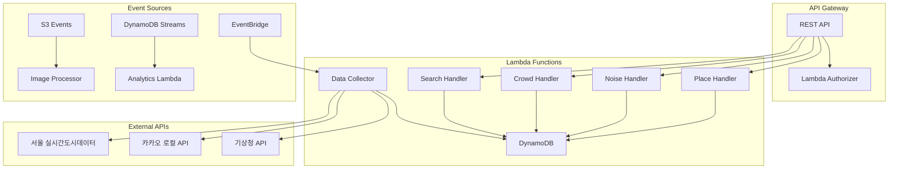

# 쉿플레이스 백엔드 개발 가이드 (Serverless)

## 🎯 서버리스 백엔드 아키텍처



## 📊 DynamoDB 테이블 설계

### Places Table
```
PK: place_id (String)
SK: METADATA
GSI1PK: geohash (String) - 지역별 검색용
GSI1SK: total_score (Number) - 점수순 정렬용
Attributes:
- name: 장소명
- latitude: 위도
- longitude: 경도
- geohash: GeoHash 값 (검색 최적화)
- category: 장소 카테고리
- address: 주소
- total_score: 종합 점수
- created_at: 생성일시
- updated_at: 수정일시
```

### NoiseData Table
```
PK: place_id (String)
SK: timestamp (String, ISO format)
TTL: expires_at (Number) - 7일 후 자동 삭제
Attributes:
- noise_level: 소음도 (dB)
- noise_score: 소음 점수 (1-10)
- traffic_volume: 교통량
- weather_condition: 날씨 상태
- data_source: 데이터 출처
```

### CrowdData Table
```
PK: place_id (String)
SK: timestamp (String, ISO format)
TTL: expires_at (Number) - 7일 후 자동 삭제
Attributes:
- crowd_density: 인구 밀도
- crowd_score: 혼잡도 점수 (1-10)
- subway_usage: 지하철 이용량
- bus_usage: 버스 이용량
- parking_usage: 주차장 이용률
```

## ⏰ 12시간 개발 타임라인

### 0-2시간: Lambda 함수 설정 + DynamoDB 스키마

```mermaid
gantt
    title 서버리스 초기 설정
    dateFormat HH:mm
    axisFormat %H:%M
    
    section 환경설정
    Node.js Lambda 프로젝트 생성  :done, setup1, 00:00, 00:30
    DynamoDB 테이블 설계         :done, setup2, 00:30, 01:00
    API Gateway 기본 설정       :done, setup3, 01:00, 01:30
    Lambda 함수 구조 생성        :done, setup4, 01:30, 02:00
```


**작업 내용:**
- [ ] Node.js Lambda 프로젝트 초기화
- [ ] AWS SDK v3 설정 및 DynamoDB 클라이언트 구성
- [ ] DynamoDB 테이블 생성 (CDK 또는 CLI)
- [ ] Lambda 함수별 디렉토리 구조 생성
- [ ] 환경 변수 및 IAM 역할 설정

**핵심 파일:**
```
backend/
├── src/
│   ├── handlers/
│   │   ├── place.js
│   │   ├── noise.js
│   │   ├── crowd.js
│   │   └── search.js
│   ├── services/
│   │   ├── dynamodb.js
│   │   └── external-api.js
│   ├── utils/
│   │   ├── geohash.js
│   │   └── response.js
│   └── config/
│       └── aws.js
├── package.json
└── serverless.yml
```

### 2-4시간: 기본 API Lambda 개발 (CRUD)

```mermaid
gantt
    title 기본 Lambda API 개발
    dateFormat HH:mm
    axisFormat %H:%M
    
    section Lambda 개발
    Place CRUD Lambda          :api1, 02:00, 02:45
    DynamoDB 연동 로직          :api2, 02:45, 03:30
    API Gateway 통합           :api3, 03:30, 04:00
```


**작업 내용:**
- [ ] Place CRUD Lambda 함수 구현
- [ ] DynamoDB 쿼리 및 스캔 로직
- [ ] API Gateway와 Lambda 프록시 통합
- [ ] 에러 핸들링 및 응답 포맷 표준화
- [ ] 기본 검증 로직 구현

**Lambda 함수 예시:**
```javascript
// handlers/place.js
const { DynamoDBClient } = require('@aws-sdk/client-dynamodb');
const { DynamoDBDocumentClient, GetCommand, PutCommand } = require('@aws-sdk/lib-dynamodb');

const client = new DynamoDBClient({});
const docClient = DynamoDBDocumentClient.from(client);

exports.handler = async (event) => {
  const { httpMethod, pathParameters, body } = event;
  
  try {
    switch (httpMethod) {
      case 'GET':
        return await getPlace(pathParameters.id);
      case 'POST':
        return await createPlace(JSON.parse(body));
      case 'PUT':
        return await updatePlace(pathParameters.id, JSON.parse(body));
      case 'DELETE':
        return await deletePlace(pathParameters.id);
      default:
        return {
          statusCode: 405,
          body: JSON.stringify({ message: 'Method Not Allowed' })
        };
    }
  } catch (error) {
    return {
      statusCode: 500,
      body: JSON.stringify({ message: error.message })
    };
  }
};
```

### 4-6시간: 데이터 수집 Lambda 개발

```mermaid
gantt
    title 데이터 수집 시스템
    dateFormat HH:mm
    axisFormat %H:%M
    
    section 데이터 수집
    서울 데이터 수집 Lambda      :lambda1, 04:00, 05:00
    데이터 변환 및 저장 로직      :lambda2, 05:00, 05:30
    EventBridge 스케줄링        :lambda3, 05:30, 06:00
```


**작업 내용:**
- [ ] 서울 실시간도시데이터 API 연동 Lambda
- [ ] 카카오 로컬 API 연동 (장소 정보)
- [ ] 데이터 정제 및 변환 로직
- [ ] EventBridge 규칙 설정 (5분 간격 실행)
- [ ] 배치 처리 및 에러 복구 로직

**데이터 수집 Lambda:**
```javascript
// handlers/data-collector.js
const axios = require('axios');

exports.handler = async (event) => {
  try {
    // 서울 실시간 인구 데이터 수집
    const populationData = await axios.get(
      'https://data.seoul.go.kr/SeoulRtd/getCategoryList.do',
      { params: { category: 'population' } }
    );
    
    // 교통량 데이터 수집 (소음도 추정용)
    const trafficData = await axios.get(
      'https://data.seoul.go.kr/SeoulRtd/getTrafficInfo.do'
    );
    
    // 데이터 변환 및 DynamoDB 저장
    await processAndSaveData(populationData.data, trafficData.data);
    
    return {
      statusCode: 200,
      body: JSON.stringify({ message: 'Data collection completed' })
    };
  } catch (error) {
    console.error('Data collection failed:', error);
    throw error;
  }
};
```

### 6-8시간: 소음/혼잡도 분석 로직

```mermaid
gantt
    title 분석 엔진 개발
    dateFormat HH:mm
    axisFormat %H:%M
    
    section 분석 로직
    소음도 점수화 Lambda        :analysis1, 06:00, 07:00
    혼잡도 점수화 Lambda        :analysis2, 07:00, 07:30
    실시간 점수 계산 API        :analysis3, 07:30, 08:00
```


**작업 내용:**
- [ ] 소음도 점수화 알고리즘 Lambda 구현
- [ ] 혼잡도 점수화 알고리즘 Lambda 구현
- [ ] 시간대별 가중치 적용 로직
- [ ] 날씨/이벤트 영향 분석
- [ ] DynamoDB Streams를 통한 실시간 점수 업데이트

**점수화 Lambda:**
```javascript
// handlers/score-calculator.js
exports.calculateNoiseScore = (trafficVolume, weather, timeOfDay) => {
  let baseScore = Math.min(10, Math.floor(trafficVolume / 100));
  
  // 시간대별 가중치
  const hour = new Date().getHours();
  if (hour >= 22 || hour <= 6) baseScore -= 2; // 야간 보정
  if (hour >= 7 && hour <= 9) baseScore += 2;  // 출근시간 보정
  
  // 날씨 보정
  if (weather === 'rain') baseScore += 1;
  
  return Math.max(1, Math.min(10, baseScore));
};

exports.calculateCrowdScore = (population, subwayUsage, busUsage) => {
  let baseScore = Math.min(10, Math.floor(population / 50));
  baseScore += Math.floor(subwayUsage / 1000);
  baseScore += Math.floor(busUsage / 500);
  
  return Math.max(1, Math.min(10, baseScore));
};
```

### 8-10시간: API Gateway 통합

```mermaid
gantt
    title API Gateway 통합
    dateFormat HH:mm
    axisFormat %H:%M
    
    section API 통합
    REST API 엔드포인트 설정    :api1, 08:00, 08:30
    Lambda 프록시 통합         :api2, 08:30, 09:00
    CORS 및 인증 설정         :api3, 09:00, 09:30
    API 문서화               :api4, 09:30, 10:00
```


**작업 내용:**
- [ ] API Gateway REST API 생성
- [ ] Lambda 프록시 통합 설정
- [ ] CORS 정책 설정
- [ ] API 키 또는 Cognito 인증 설정
- [ ] CloudWatch 로그 및 메트릭 설정

### 10-12시간: CDK 배포 + 테스트

```mermaid
gantt
    title 배포 및 테스트
    dateFormat HH:mm
    axisFormat %H:%M
    
    section 배포
    CDK 스택 작성             :deploy1, 10:00, 10:30
    인프라 배포               :deploy2, 10:30, 11:00
    통합 테스트               :deploy3, 11:00, 11:30
    성능 최적화               :deploy4, 11:30, 12:00
```


**작업 내용:**
- [ ] AWS CDK 스택 작성 (TypeScript)
- [ ] Lambda, API Gateway, DynamoDB 리소스 정의
- [ ] IAM 역할 및 정책 설정
- [ ] 환경별 배포 설정 (dev, prod)
- [ ] 통합 테스트 및 성능 튜닝

## 🔧 개발 환경 설정

### 필수 도구
```bash
# Node.js 18+ 설치 확인
node --version

# AWS CLI 설정
aws configure

# Serverless Framework 설치 (선택사항)
npm install -g serverless
```

### 환경 변수
```javascript
// config/aws.js
module.exports = {
  region: process.env.AWS_REGION || 'ap-northeast-2',
  dynamodb: {
    placesTable: process.env.PLACES_TABLE_NAME,
    noiseDataTable: process.env.NOISE_DATA_TABLE_NAME,
    crowdDataTable: process.env.CROWD_DATA_TABLE_NAME,
  },
  externalApi: {
    seoulDataApiKey: process.env.SEOUL_API_KEY,
    kakaoApiKey: process.env.KAKAO_API_KEY,
  }
};
```

## 📝 API 엔드포인트

### 장소 관련 API
```http
# 주변 조용한 장소 검색
GET /api/places/quiet?lat=37.5665&lng=126.9780&radius=1000
Response: {
  "places": [
    {
      "id": "place_001",
      "name": "한강공원",
      "latitude": 37.5665,
      "longitude": 126.9780,
      "noiseScore": 3,
      "crowdScore": 2,
      "totalScore": 2.5
    }
  ]
}

# 실시간 소음/혼잡도 조회
GET /api/places/{id}/current-status
Response: {
  "placeId": "place_001",
  "timestamp": "2024-01-01T12:00:00Z",
  "noiseLevel": 45.2,
  "noiseScore": 3,
  "crowdDensity": 120,
  "crowdScore": 4,
  "recommendation": "조용하고 한적함"
}
```

## 🚀 빠른 시작

```bash
# 1. 프로젝트 클론
git clone <repository-url>
cd backend

# 2. 의존성 설치
npm install

# 3. 로컬 테스트 (SAM Local)
sam local start-api

# 4. 배포
npm run deploy

# 5. API 테스트
curl https://your-api-id.execute-api.ap-northeast-2.amazonaws.com/dev/places
```

## 🔍 성능 최적화

### Lambda 최적화
- **Provisioned Concurrency**: 콜드 스타트 방지
- **메모리 설정**: 1008MB (CPU 성능 최적화)
- **연결 재사용**: DynamoDB 클라이언트 재사용

### DynamoDB 최적화
- **GSI 활용**: 지역별, 점수별 검색 최적화
- **배치 작업**: BatchGetItem, BatchWriteItem 사용
- **TTL 설정**: 오래된 데이터 자동 삭제
