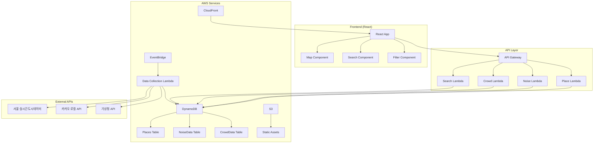

# 쉿플레이스 (ShitPlace) 🤫

조용하고 한적한 곳을 찾는 사람들을 위한 소음·혼잡도 기반 지도 서비스

## 🎯 프로젝트 개요

실시간 소음도와 혼잡도 데이터를 기반으로 조용하고 한적한 장소를 추천하는 서버리스 지도 서비스입니다.

## 🏗️ 서버리스 아키텍처



## 🛠️ 서버리스 기술 스택

### Backend (Serverless)
- **Runtime**: Node.js 18 (Lambda)
- **Framework**: AWS Lambda + API Gateway
- **Database**: AWS DynamoDB
- **Authentication**: AWS Cognito
- **File Storage**: AWS S3
- **Scheduling**: AWS EventBridge
- **Infrastructure**: AWS CDK (IaC)

### Frontend
- **Framework**: React 18
- **Map**: Kakao Map API
- **State Management**: Redux Toolkit
- **UI Library**: Material-UI
- **Build Tool**: Vite

### AWS Services
- **Compute**: AWS Lambda
- **Database**: DynamoDB
- **Storage**: S3
- **CDN**: CloudFront
- **API**: API Gateway
- **Scheduling**: EventBridge
- **Monitoring**: CloudWatch
- **Infrastructure**: CDK

## 📁 프로젝트 구조

```
shitplace/
├── backend/           # AWS Lambda Functions
├── frontend/          # React 웹 애플리케이션
├── infrastructure/    # AWS CDK 코드
└── docs/             # 프로젝트 문서
```

## ⏰ 12시간 개발 타임라인

| 시간 | 백엔드 | 프론트엔드 |
|------|--------|------------|
| 0-2h | Lambda 함수 설정 + DynamoDB 스키마 | React 프로젝트 설정 + 기본 라우팅 |
| 2-4h | 기본 API Lambda 개발 (CRUD) | 지도 컴포넌트 + 기본 UI |
| 4-6h | 데이터 수집 Lambda 개발 | 검색/필터 기능 구현 |
| 6-8h | 소음/혼잡도 분석 로직 | 실시간 데이터 연동 |
| 8-10h | API Gateway 통합 | UI/UX 개선 |
| 10-12h | CDK 배포 + 테스트 | 배포 + 최적화 |

## 🚀 시작하기

### 사전 요구사항
- Node.js 18+
- AWS CLI 설정
- AWS CDK 설치

### 개발 환경 설정

1. **저장소 클론**
```bash
git clone https://github.com/team22/shitplace.git
cd shitplace
```

2. **백엔드 설정**
```bash
cd backend
npm install
npm run deploy:dev
```

3. **프론트엔드 설정**
```bash
cd frontend
npm install
npm run dev
```

4. **인프라 배포**
```bash
cd infrastructure
cdk deploy
```

## 📊 데이터 소스

### 서울 열린데이터광장
- 실시간 인구 데이터
- 교통량 데이터
- 지하철/버스 승하차 데이터
- 공영주차장 현황

### 외부 API
- 카카오 로컬 API (장소 정보)
- 기상청 API (날씨 데이터)

## 🤝 팀 역할

- **팀원 1**: 백엔드 API + DynamoDB 설계
- **팀원 2**: 데이터 수집 Lambda + 분석 로직
- **팀원 3**: React 프론트엔드 + 지도 연동
- **팀원 4**: AWS 인프라 + 배포 자동화

## 📈 개발 진행상황

- [ ] 백엔드 API 개발
- [ ] 프론트엔드 개발
- [ ] 데이터 수집 시스템
- [ ] AWS 인프라 구축
- [ ] 통합 테스트
- [ ] 배포

---

각 디렉토리별 상세 개발 가이드는 해당 폴더의 README를 참고하세요.
- [Backend 개발 가이드](./backend/README.md)
- [Frontend 개발 가이드](./frontend/README.md)