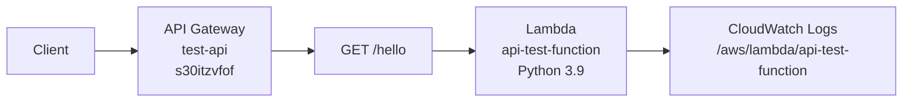

# AWS 인프라 구성 분석 (us-east-1 리전)

## 개요
현재 AWS 계정 `533266989224`의 us-east-1 리전에 배포된 API Gateway와 Lambda 함수의 구성을 분석한 문서입니다.

## Lambda 함수

### 1. api-test-function
- **ARN**: `arn:aws:lambda:us-east-1:533266989224:function:api-test-function`
- **런타임**: Python 3.9
- **핸들러**: `api_lambda.lambda_handler`
- **메모리**: 128MB
- **타임아웃**: 3초
- **IAM 역할**: `lambda-api-role`
- **마지막 수정**: 2025-09-05 03:26:29 UTC
- **상태**: Active
- **아키텍처**: x86_64
- **로그 그룹**: `/aws/lambda/api-test-function`

### 2. WSConcurrencyCurtailer-DO-NOT-USE
- **ARN**: `arn:aws:lambda:us-east-1:533266989224:function:WSConcurrencyCurtailer-DO-NOT-USE`
- **런타임**: provided.al2023
- **핸들러**: main
- **메모리**: 128MB
- **타임아웃**: 3초
- **용도**: AWS 내부 동시성 제어 (사용 금지)

## API Gateway

### REST API: test-api
- **API ID**: `s30itzvfof`
- **이름**: test-api
- **설명**: Test API for Lambda
- **생성일**: 2025-09-05 12:26:35 KST
- **엔드포인트 타입**: EDGE
- **루트 리소스 ID**: `foqtd1gfe8`

#### 리소스 구조
```
/ (foqtd1gfe8)
└── /hello (w4woe3)
    └── GET
```

#### 엔드포인트 상세

##### GET /hello
- **HTTP 메서드**: GET
- **인증**: NONE (인증 없음)
- **API 키 필요**: false
- **통합 타입**: AWS_PROXY (Lambda 프록시 통합)
- **연결된 Lambda**: `api-test-function`
- **타임아웃**: 29초

## 아키텍처 다이어그램



## 통합 구성

### Lambda 프록시 통합
- **통합 URI**: `arn:aws:apigateway:us-east-1:lambda:path/2015-03-31/functions/arn:aws:lambda:us-east-1:533266989224:function:api-test-function/invocations`
- **HTTP 메서드**: POST (API Gateway → Lambda)
- **Passthrough Behavior**: WHEN_NO_MATCH

## 보안 설정

### API Gateway
- 인증: 없음 (NONE)
- API 키: 불필요
- CORS: 설정되지 않음

### Lambda
- IAM 역할: `lambda-api-role`
- VPC: 설정되지 않음 (인터넷 액세스 가능)

## 모니터링

### CloudWatch 로그
- Lambda 로그: `/aws/lambda/api-test-function`
- API Gateway 로그: 설정되지 않음

## 현재 상태 요약

1. **단순한 테스트 구성**: 하나의 API Gateway와 하나의 Lambda 함수로 구성된 기본적인 테스트 환경
2. **보안 미설정**: 인증, API 키, CORS 등 보안 설정이 적용되지 않음
3. **최소 리소스**: 메모리 128MB, 타임아웃 3초로 최소 설정
4. **프로덕션 준비 미완료**: 로깅, 모니터링, 에러 핸들링 등이 기본 수준

## 개선 권장사항

1. **보안 강화**
   - API 키 또는 Cognito 인증 추가
   - CORS 정책 설정
   - WAF 적용 검토

2. **모니터링 개선**
   - API Gateway 로그 활성화
   - CloudWatch 메트릭 및 알람 설정
   - X-Ray 트레이싱 활성화

3. **성능 최적화**
   - Lambda 메모리 및 타임아웃 조정
   - Provisioned Concurrency 검토

4. **인프라 코드화**
   - CDK 또는 CloudFormation으로 인프라 관리
   - 환경별 배포 파이프라인 구축
