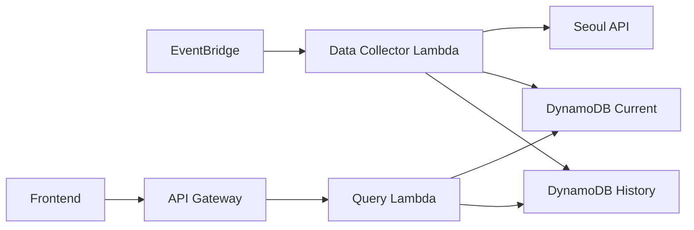
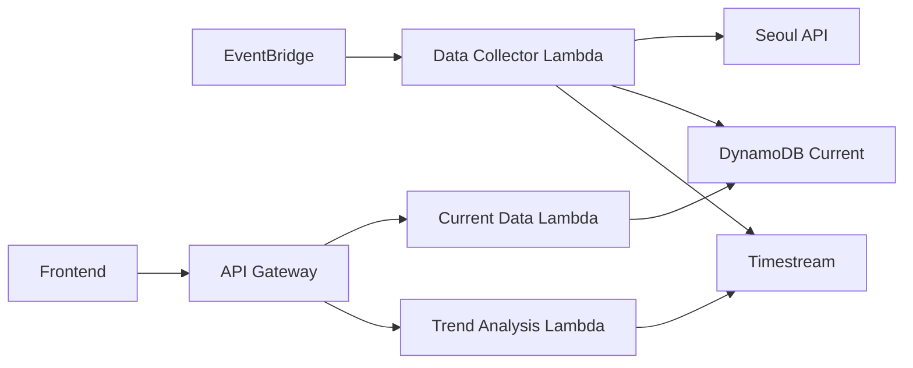

# API 호출 제한 상황에서의 데이터 저장 전략 분석

## 🎯 현재 상황
- 서울 공공 API 호출 횟수 제한 존재
- 프론트엔드에서 실시간 데이터 필요
- 데이터 저장 후 조회하는 구조 필요

## 📊 DynamoDB vs Timestream 비교 분석

### 1. 데이터 저장 패턴

#### DynamoDB 저장 구조
```javascript
// 현재 상태 테이블 (최신 데이터만 유지)
{
  PK: "place_gangnam_station",
  SK: "CURRENT",
  geohash: "wydm6k",
  latitude: 37.4979,
  longitude: 127.0276,
  population: 2500,
  crowdLevel: "high",
  noiseLevel: "medium",
  lastUpdated: "2025-09-05T14:30:00Z",
  ttl: 1725544200  // 1시간 후 만료
}

// 히스토리 테이블 (시계열 데이터)
{
  PK: "place_gangnam_station",
  SK: "2025-09-05T14:30:00Z",
  population: 2500,
  crowdLevel: "high",
  ttl: 1726149000  // 7일 후 만료
}
```

#### Timestream 저장 구조
```javascript
// 시계열 데이터 (자동 압축)
{
  Dimensions: [
    { Name: "place_id", Value: "gangnam_station" },
    { Name: "district", Value: "강남구" },
    { Name: "geohash", Value: "wydm6k" }
  ],
  MeasureName: "population",
  MeasureValue: "2500",
  Time: "2025-09-05T14:30:00Z"
}
```

### 2. 프론트엔드 사용 패턴별 적합성

#### 지도 기반 실시간 조회
```javascript
// DynamoDB - 지리적 검색 (우수)
const getNearbyPlaces = async (lat, lng, radius) => {
  const geohash = encodeGeohash(lat, lng, 6);
  const neighbors = getNeighbors(geohash);
  
  // 병렬 쿼리로 주변 지역 검색
  const queries = neighbors.map(hash => 
    dynamodb.query({
      IndexName: 'GeohashIndex',
      KeyConditionExpression: 'geohash = :hash AND SK = :current',
      ExpressionAttributeValues: {
        ':hash': hash,
        ':current': 'CURRENT'
      }
    }).promise()
  );
  
  return Promise.all(queries);
};

// Timestream - 지리적 검색 (제한적)
const getNearbyPlacesTS = async (lat, lng, radius) => {
  // 수동으로 위경도 범위 계산 필요
  const bounds = calculateBounds(lat, lng, radius);
  
  const query = `
    SELECT place_id, latitude, longitude, 
           last_value(measure_value::double) as population
    FROM "DB"."Table"
    WHERE time >= ago(15m)
      AND latitude BETWEEN ${bounds.minLat} AND ${bounds.maxLat}
      AND longitude BETWEEN ${bounds.minLng} AND ${bounds.maxLng}
    GROUP BY place_id, latitude, longitude
  `;
  
  return timestream.query({ QueryString: query });
};
```

#### 시계열 트렌드 조회
```javascript
// DynamoDB - 시계열 조회 (가능하지만 비효율)
const getPopulationTrend = async (placeId, hours = 24) => {
  const startTime = new Date(Date.now() - hours * 60 * 60 * 1000);
  
  return dynamodb.query({
    KeyConditionExpression: 'PK = :placeId AND SK >= :startTime',
    ExpressionAttributeValues: {
      ':placeId': placeId,
      ':startTime': startTime.toISOString()
    },
    ScanIndexForward: true
  }).promise();
};

// Timestream - 시계열 조회 (최적화됨)
const getPopulationTrendTS = async (placeId, hours = 24) => {
  const query = `
    SELECT 
      time,
      measure_value::double as population,
      AVG(measure_value::double) OVER (
        ORDER BY time 
        ROWS BETWEEN 2 PRECEDING AND 2 FOLLOWING
      ) as smoothed_population
    FROM "DB"."Table"
    WHERE place_id = '${placeId}'
      AND time >= ago(${hours}h)
    ORDER BY time
  `;
  
  return timestream.query({ QueryString: query });
};
```

### 3. 비용 및 성능 분석

#### 데이터 수집 시나리오
- **장소 수**: 1,000개
- **수집 주기**: 10분마다
- **데이터 보관**: 7일
- **일일 데이터 포인트**: 144,000개

#### DynamoDB 비용 (월간)
```
현재 상태 테이블:
- 항목 수: 1,000개 (최신 데이터만)
- 스토리지: ~1MB
- 읽기: 10,000 RCU/월 (지도 조회)
- 쓰기: 4,320 WCU/월 (10분마다 업데이트)
- 예상 비용: ~$15/월

히스토리 테이블:
- 항목 수: 1,008,000개 (7일간)
- 스토리지: ~100MB
- TTL 자동 삭제
- 예상 비용: ~$5/월

총 비용: ~$20/월
```

#### Timestream 비용 (월간)
```
메모리 스토어 (최근 24시간):
- 데이터: 144,000 포인트/일
- 비용: ~$30/월

자기 스토어 (7일간):
- 데이터: 1,008,000 포인트
- 압축률: ~10:1
- 비용: ~$10/월

쿼리 비용: ~$5/월

총 비용: ~$45/월
```

### 4. 개발 복잡도

#### DynamoDB 구현
```javascript
// 간단한 CRUD 패턴
const updatePlaceData = async (placeId, data) => {
  // 현재 상태 업데이트
  await dynamodb.put({
    TableName: 'PlacesCurrent',
    Item: {
      PK: placeId,
      SK: 'CURRENT',
      ...data,
      ttl: Math.floor(Date.now() / 1000) + 3600
    }
  }).promise();
  
  // 히스토리 저장
  await dynamodb.put({
    TableName: 'PlacesHistory',
    Item: {
      PK: placeId,
      SK: new Date().toISOString(),
      ...data,
      ttl: Math.floor(Date.now() / 1000) + 604800
    }
  }).promise();
};
```

#### Timestream 구현
```javascript
// 배치 처리 필요
const updatePlaceDataTS = async (places) => {
  const records = places.map(place => ({
    Dimensions: [
      { Name: "place_id", Value: place.id },
      { Name: "geohash", Value: place.geohash }
    ],
    MeasureName: "population",
    MeasureValue: place.population.toString(),
    Time: Date.now().toString()
  }));
  
  // 100개씩 배치 처리
  const batches = chunk(records, 100);
  for (const batch of batches) {
    await timestream.writeRecords({
      DatabaseName: "ShitPlaceDB",
      TableName: "PopulationData",
      Records: batch
    }).promise();
  }
};
```

## 🎯 상황별 권장사항

### 프론트엔드 요구사항 우선순위

#### 1순위: 지도 기반 실시간 검색
**권장: DynamoDB**
- 지리적 검색 필수
- 빠른 응답 속도 필요
- 현재 상태 조회 중심

#### 2순위: 시계열 분석 + 지도 검색
**권장: DynamoDB + Timestream 하이브리드**
```javascript
// 현재 상태: DynamoDB
const currentPlaces = await getCurrentPlaces(lat, lng, radius);

// 트렌드 분석: Timestream
const trends = await getPlaceTrends(placeIds, '24h');

// 프론트엔드에서 결합
const enrichedData = mergePlaceData(currentPlaces, trends);
```

#### 3순위: 시계열 분석 중심
**권장: Timestream + 캐싱**
- Redis/ElastiCache로 최근 데이터 캐싱
- 지리적 검색은 제한적 구현

## 🚀 최종 권장 아키텍처

### Phase 1: DynamoDB 단독 (즉시 구현)


### Phase 2: 하이브리드 (확장시)


## 📋 결론

**현재 상황에서는 DynamoDB가 최적:**

1. **지리적 검색 필수**: 프론트엔드 지도 서비스
2. **낮은 비용**: Timestream 대비 50% 절약
3. **간단한 구현**: 기존 패턴 활용 가능
4. **빠른 개발**: 12시간 해커톤에 적합

**Timestream은 나중에 고급 분석이 필요할 때 추가 검토**
