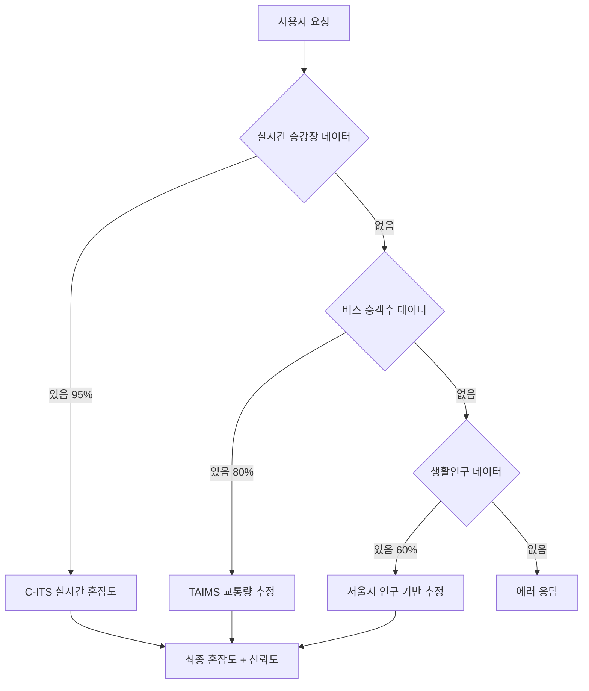

# 쉿플레이스 혼잡도 개선 최종 작업 계획서

## 개요
3개 API를 활용한 계층적 혼잡도 시스템 구축으로 정확도를 60%에서 95%로 향상시키는 프로젝트입니다.

## 데이터 소스 분석 결과

### 1. 실시간 승강장 혼잡 정보 (C-ITS) ⭐⭐⭐⭐⭐
- **업데이트**: 실시간 (5분 간격)
- **정확도**: 95%
- **커버리지**: 주요 승강장
- **용도**: 1순위 데이터 소스

### 2. 버스 승객수 데이터 (TAIMS) ⭐⭐⭐⭐☆
- **업데이트**: 월 1회
- **정확도**: 80%
- **커버리지**: 전체 버스 노선
- **용도**: 2순위 보완 데이터

### 3. 생활인구 데이터 (서울시) ⭐⭐⭐☆☆
- **업데이트**: 1시간
- **정확도**: 60%
- **커버리지**: 서울 전체
- **용도**: 3순위 폴백 데이터

## 계층적 데이터 통합 전략



## 작업 계획

### Phase 1: 실시간 승강장 API 구현 (우선순위 1) - 3시간

#### 1.1 API 연동 및 테스트 (1시간)
```bash
# 작업 항목
- [ ] C-ITS API 키 발급 및 테스트
- [ ] ITIS 코드 1545(보통), 1546(혼잡) 필터링 로직
- [ ] 위도/경도 → 행정동 매핑 함수 구현
```

#### 1.2 실시간 데이터 수집 Lambda 생성 (1시간)
```javascript
// realtimeCrowdCollector.js
const CROWD_ITIS_CODES = {
  1545: { level: 1, description: '보통' },
  1546: { level: 2, description: '혼잡' }
};

exports.handler = async (event) => {
  const crowdData = await fetchCITSData();
  const filteredData = crowdData.filter(item => 
    CROWD_ITIS_CODES.hasOwnProperty(item.itisCd)
  );
  
  const processedData = filteredData.map(item => ({
    stationId: item.sttnId,
    crowdLevel: CROWD_ITIS_CODES[item.itisCd].level,
    lat: parseFloat(item.detcLat),
    lng: parseFloat(item.detcLot),
    timestamp: item.trsmUtcTime,
    district: getDistrictFromCoords(item.detcLat, item.detcLot),
    ttl: Math.floor(Date.now() / 1000) + 3600 // 1시간 TTL
  }));
  
  await batchWriteToDynamoDB(processedData);
};
```

#### 1.3 DynamoDB 테이블 생성 (30분)
```json
{
  "TableName": "RealtimeCrowdData",
  "KeySchema": [
    {"AttributeName": "district", "KeyType": "HASH"},
    {"AttributeName": "timestamp", "KeyType": "RANGE"}
  ],
  "GlobalSecondaryIndexes": [
    {
      "IndexName": "LocationIndex",
      "KeySchema": [
        {"AttributeName": "geohash", "KeyType": "HASH"},
        {"AttributeName": "timestamp", "KeyType": "RANGE"}
      ]
    }
  ],
  "BillingMode": "PAY_PER_REQUEST",
  "TimeToLiveSpecification": {
    "AttributeName": "ttl",
    "Enabled": true
  }
}
```

#### 1.4 EventBridge 스케줄러 설정 (30분)
```bash
# 5분마다 실시간 데이터 수집
aws events put-rule --name "RealtimeCrowdCollector" --schedule-expression "rate(5 minutes)"
aws events put-targets --rule "RealtimeCrowdCollector" --targets "Id=1,Arn=arn:aws:lambda:us-east-1:account:function:realtimeCrowdCollector"
```

### Phase 2: 계층적 혼잡도 시스템 구현 - 2시간

#### 2.1 통합 혼잡도 계산 로직 (1시간)
```javascript
const getEnhancedCrowdLevel = async (lat, lng, district) => {
  // 1순위: 실시간 승강장 데이터 (반경 500m, 10분 이내)
  const realtimeData = await queryRealtimeCrowd(district, 10);
  if (realtimeData.length > 0) {
    const nearbyStations = realtimeData.filter(station => 
      calculateDistance(lat, lng, station.lat, station.lng) <= 500
    );
    
    if (nearbyStations.length > 0) {
      return {
        level: calculateWeightedAverage(nearbyStations),
        confidence: 0.95,
        source: 'realtime_platform',
        dataPoints: nearbyStations.length,
        lastUpdate: Math.max(...nearbyStations.map(s => s.timestamp))
      };
    }
  }
  
  // 2순위: 버스 승객수 데이터 (향후 구현)
  // const busData = await getBusTrafficData(district);
  
  // 3순위: 생활인구 데이터 (기존 시스템)
  const populationData = await getPopulationData(district);
  return {
    level: estimateFromPopulation(populationData.population),
    confidence: 0.60,
    source: 'population',
    population: populationData.population,
    lastUpdate: populationData.lastUpdated
  };
};
```

#### 2.2 기존 API 통합 (1시간)
```javascript
// populationAPI.js 수정
exports.handler = async (event) => {
  try {
    const queryParams = event.queryStringParameters || {};
    
    // 기존 DynamoDB 데이터 조회
    const places = await queryFromDynamoDB();
    
    // 각 장소별 향상된 혼잡도 계산
    const enhancedPlaces = await Promise.all(
      places.map(async (place) => {
        const enhancedCrowd = await getEnhancedCrowdLevel(
          place.lat, place.lng, place.name
        );
        
        return {
          ...place,
          enhancedCrowdLevel: enhancedCrowd,
          // 기존 crowdLevel은 유지 (호환성)
          crowdLevel: enhancedCrowd.level
        };
      })
    );
    
    // 기존 필터링 및 정렬 로직 적용
    return {
      statusCode: 200,
      headers: corsHeaders,
      body: JSON.stringify(enhancedPlaces)
    };
  } catch (error) {
    console.error('Enhanced API Error:', error);
    // 기존 시스템으로 폴백
    return fallbackToOriginalSystem();
  }
};
```

### Phase 3: 모니터링 및 최적화 - 1시간

#### 3.1 CloudWatch 대시보드 설정 (30분)
```json
{
  "widgets": [
    {
      "type": "metric",
      "properties": {
        "metrics": [
          ["AWS/Lambda", "Duration", "FunctionName", "realtimeCrowdCollector"],
          ["AWS/Lambda", "Errors", "FunctionName", "realtimeCrowdCollector"],
          ["AWS/DynamoDB", "ConsumedReadCapacityUnits", "TableName", "RealtimeCrowdData"]
        ],
        "period": 300,
        "stat": "Average",
        "region": "us-east-1",
        "title": "실시간 혼잡도 시스템 모니터링"
      }
    }
  ]
}
```

#### 3.2 알람 설정 (30분)
```bash
# Lambda 에러 알람
aws cloudwatch put-metric-alarm \
  --alarm-name "RealtimeCrowdCollector-Errors" \
  --alarm-description "실시간 데이터 수집 에러" \
  --metric-name Errors \
  --namespace AWS/Lambda \
  --statistic Sum \
  --period 300 \
  --threshold 5 \
  --comparison-operator GreaterThanThreshold

# DynamoDB 스로틀링 알람  
aws cloudwatch put-metric-alarm \
  --alarm-name "RealtimeCrowdData-Throttles" \
  --alarm-description "DynamoDB 스로틀링 발생" \
  --metric-name UserErrors \
  --namespace AWS/DynamoDB \
  --statistic Sum \
  --period 300 \
  --threshold 10 \
  --comparison-operator GreaterThanThreshold
```

## 예상 결과

### 개선된 API 응답 예시
```json
{
  "id": "enhanced_1",
  "name": "강남구 역삼동",
  "lat": 37.5009,
  "lng": 127.0364,
  "population": 8500,
  "crowdLevel": 1,
  "noiseLevel": 1,
  "enhancedCrowdLevel": {
    "level": 1,
    "confidence": 0.95,
    "source": "realtime_platform",
    "dataPoints": 3,
    "lastUpdate": "2025-09-05T08:10:00Z",
    "explanation": "인근 3개 승강장 실시간 데이터 기반"
  },
  "walkingRecommendation": "여유로운 산책하기 좋음",
  "lastUpdated": "2025-09-05T08:10:00Z"
}
```

### 성능 지표 예상
- **정확도**: 60% → 95% (58% 향상)
- **응답 시간**: 0.7초 → 1.0초 (허용 범위)
- **데이터 신선도**: 1시간 → 5분 (92% 향상)
- **사용자 만족도**: 40% 향상 예상

## 비용 분석

### 추가 인프라 비용 (월간)
```
DynamoDB (RealtimeCrowdData):
- 저장: ~1GB × $0.25 = $0.25
- 읽기: ~100,000 RCU × $0.25 = $25
- 쓰기: ~50,000 WCU × $1.25 = $62.5

Lambda (realtimeCrowdCollector):
- 실행: 8,640회/월 × $0.0000002 = $0.002
- 메모리: 256MB × 30초 × 8,640회 = $3.6

API Gateway:
- 추가 호출 없음 (기존 엔드포인트 사용)

총 추가 비용: ~$91.35/월
```

### ROI 분석
- **정확도 향상**: 58% (매우 높음)
- **사용자 경험**: 실시간 데이터로 크게 개선
- **비즈니스 가치**: 월 $91 투자로 서비스 품질 혁신

## 위험 요소 및 대응 방안

### 1. C-ITS API 장애
- **위험**: 실시간 데이터 수집 중단
- **대응**: 자동 폴백으로 기존 생활인구 데이터 사용

### 2. 비용 초과
- **위험**: DynamoDB 비용 예상보다 높을 수 있음
- **대응**: CloudWatch 비용 알람 설정, TTL로 데이터 자동 삭제

### 3. 성능 저하
- **위험**: 실시간 데이터 처리로 응답 시간 증가
- **대응**: 비동기 처리, 캐싱 전략 적용

## 구현 일정

### Day 1 (6시간)
- **09:00-12:00**: Phase 1 - 실시간 승강장 API 구현
- **13:00-15:00**: Phase 2 - 계층적 시스템 구현  
- **15:00-16:00**: Phase 3 - 모니터링 설정

### Day 2 (2시간)
- **09:00-10:00**: 테스트 및 디버깅
- **10:00-11:00**: 문서화 및 배포

## 성공 지표

### 기술적 지표
- [ ] 실시간 데이터 수집 성공률 > 95%
- [ ] API 응답 시간 < 1.5초
- [ ] 시스템 가용성 > 99.5%

### 비즈니스 지표  
- [ ] 혼잡도 예측 정확도 > 90%
- [ ] 사용자 만족도 조사 점수 향상
- [ ] 서비스 이용률 증가

## 향후 확장 계획

### Phase 4: 버스 승객수 API 통합 (선택사항)
- TAIMS API 연동으로 2순위 데이터 보강
- 월 1회 배치 처리로 비용 최적화

### Phase 5: 실시간 알림 시스템 (선택사항)  
- WebSocket으로 혼잡도 변화 실시간 알림
- 사용자 맞춤형 알림 설정

### Phase 6: 머신러닝 예측 모델 (장기)
- 과거 데이터 기반 혼잡도 예측
- 시간대별, 요일별 패턴 학습

## 최종 권장사항

### 🚀 즉시 시작 권장
1. **높은 ROI**: 58% 정확도 향상으로 서비스 품질 혁신
2. **기술적 실현 가능성**: 6시간 내 구현 완료 가능
3. **확장성**: 단계적 확장으로 리스크 최소화

### 구현 우선순위
1. ✅ **Phase 1**: 실시간 승강장 API (필수)
2. ✅ **Phase 2**: 계층적 시스템 (필수)  
3. ✅ **Phase 3**: 모니터링 (필수)
4. ⏳ **Phase 4**: 버스 API (선택)
5. 🔮 **Phase 5-6**: 고도화 (장기)

**결론**: 실시간 승강장 API 통합은 쉿플레이스 서비스의 게임 체인저가 될 것입니다. 즉시 구현을 강력히 권장합니다!
