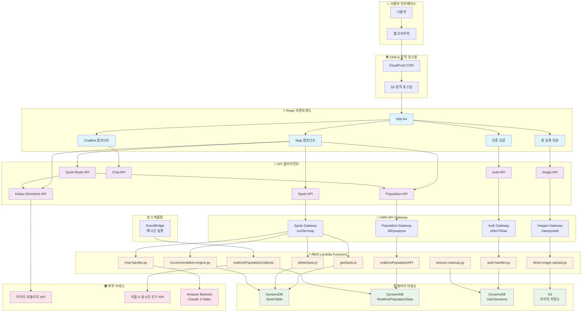
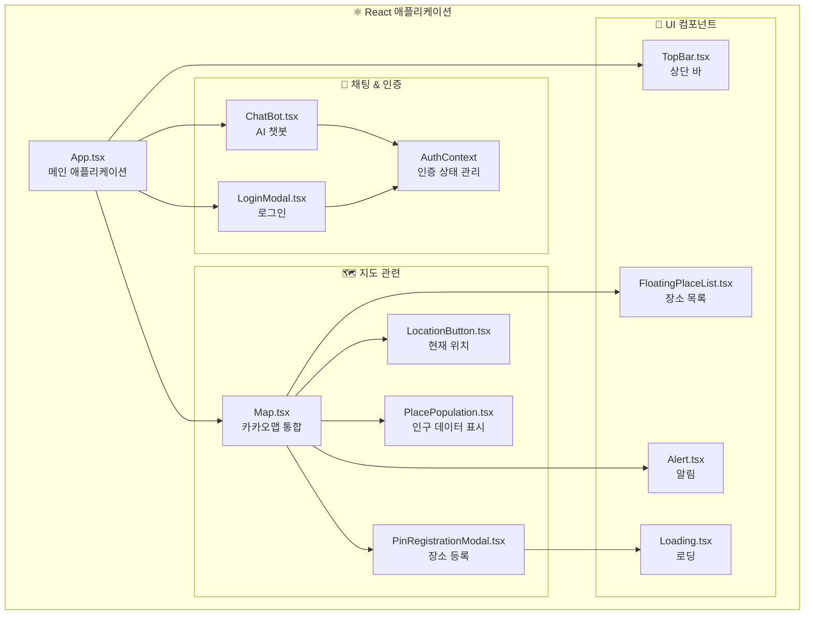
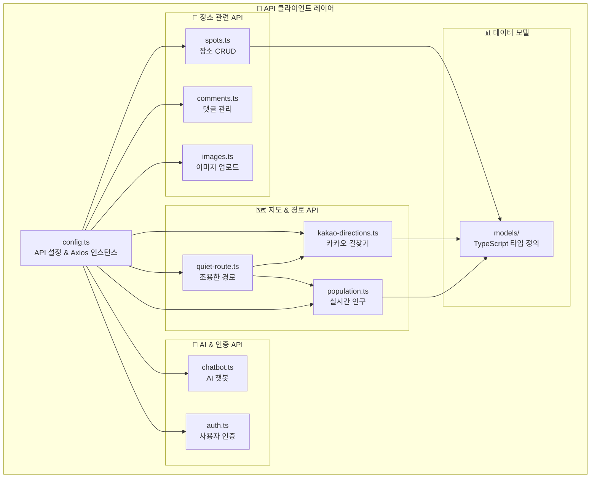
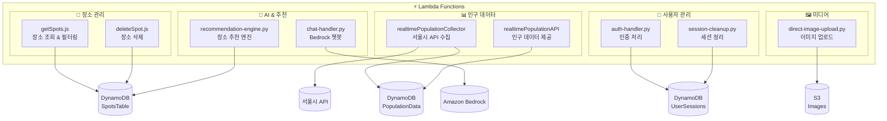
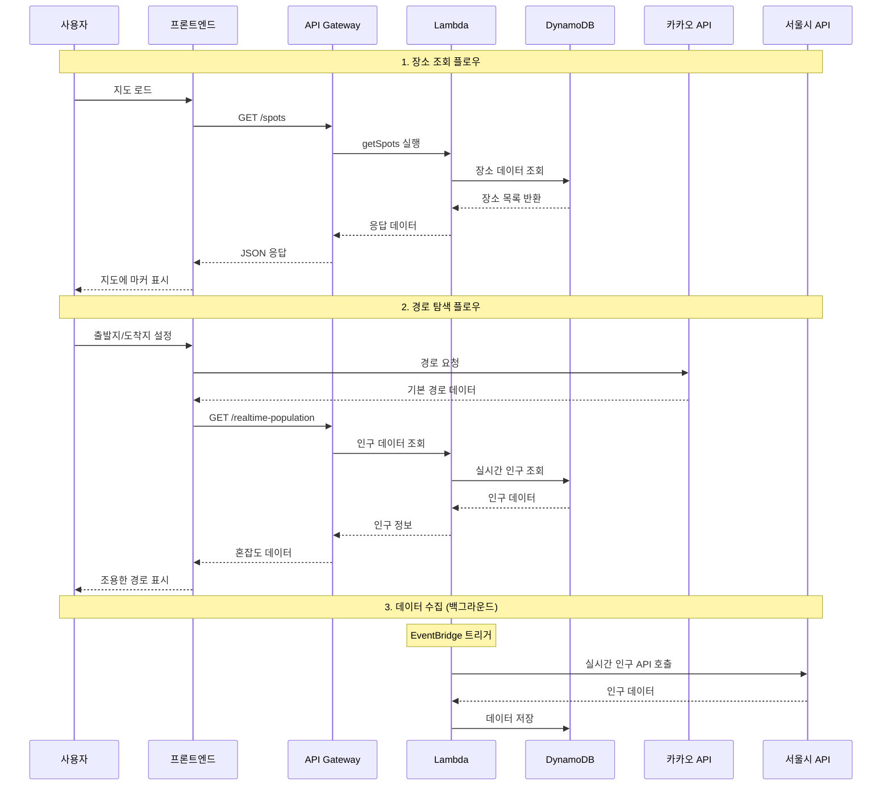

# 🤫 쉿플레이스 - 시스템 아키텍처 다이어그램

## 📊 전체 시스템 아키텍처

## 🏗️ 컴포넌트별 상세 아키텍처

### 1. 프론트엔드 컴포넌트 구조

### 2. API 클라이언트 구조

### 3. AWS Lambda 함수 구조

### 4. 데이터 플로우

## 🔧 기술 스택 요약

### Frontend
- **Framework**: React 18 + TypeScript
- **Build Tool**: Vite
- **Map**: Kakao Maps API
- **HTTP Client**: Axios
- **State Management**: React Context

### Backend
- **API Gateway**: AWS API Gateway (REST)
- **Compute**: AWS Lambda (Node.js 18, Python 3.9)
- **Database**: DynamoDB
- **Storage**: S3
- **CDN**: CloudFront
- **AI**: Amazon Bedrock (Claude 3 Haiku)
- **Scheduling**: EventBridge

### External APIs
- **Kakao Mobility API**: 실시간 길찾기
- **서울시 열린데이터 광장**: 실시간 인구 데이터

### Infrastructure
- **IaC**: Terraform
- **Deployment**: Shell Scripts + AWS CLI
- **Monitoring**: CloudWatch

## 📈 확장성 고려사항

1. **수평 확장**: Lambda 자동 스케일링
2. **캐싱**: CloudFront + DynamoDB DAX (향후)
3. **모니터링**: CloudWatch + X-Ray (향후)
4. **보안**: API Gateway 인증 + CORS
5. **성능**: 지역별 데이터 파티셔닝 (향후)
