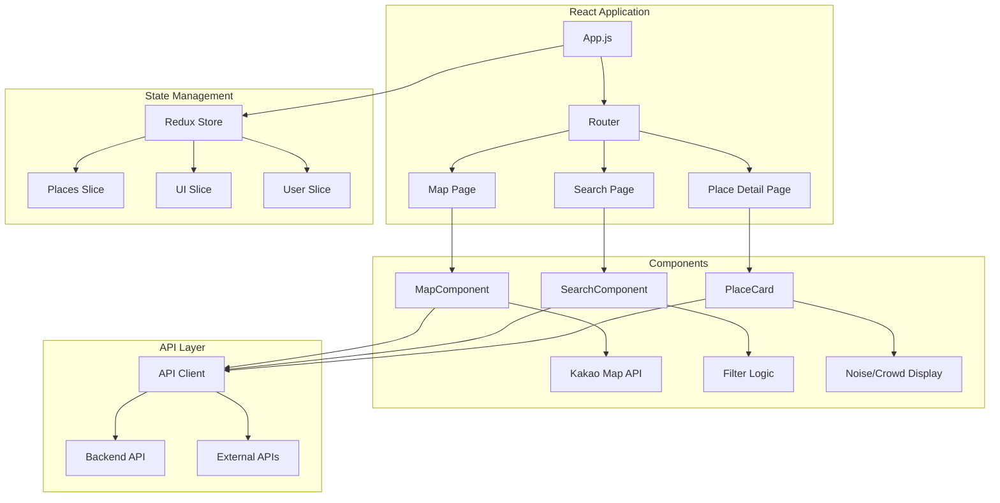

# 쉿플레이스 프론트엔드 개발 가이드

## 🎯 프론트엔드 아키텍처



## 🛠️ 기술 스택

### Core
- **React 18**: 함수형 컴포넌트 + Hooks
- **TypeScript**: 타입 안정성
- **Vite**: 빠른 개발 서버 및 빌드
- **React Router v6**: 클라이언트 사이드 라우팅

### UI/UX
- **Material-UI (MUI)**: 컴포넌트 라이브러리
- **Emotion**: CSS-in-JS 스타일링
- **React Spring**: 애니메이션
- **Framer Motion**: 고급 애니메이션 (선택사항)

### 상태 관리
- **Redux Toolkit**: 전역 상태 관리
- **RTK Query**: API 상태 관리 및 캐싱
- **React Hook Form**: 폼 상태 관리

### 지도 & 위치
- **Kakao Map API**: 지도 서비스
- **Geolocation API**: 현재 위치 획득
- **GeoHash**: 위치 기반 검색 최적화

## ⏰ 12시간 개발 타임라인

### 0-2시간: 프로젝트 초기 설정

```mermaid
gantt
    title 프론트엔드 초기 설정
    dateFormat HH:mm
    axisFormat %H:%M
    
    section 환경설정
    Vite React 프로젝트 생성     :done, setup1, 00:00, 00:30
    TypeScript 설정            :done, setup2, 00:30, 01:00
    라이브러리 설치             :done, setup3, 01:00, 01:30
    기본 라우팅 설정            :done, setup4, 01:30, 02:00
```


**작업 내용:**
- [ ] Vite + React + TypeScript 프로젝트 생성
- [ ] 필수 라이브러리 설치 (MUI, Redux Toolkit, React Router)
- [ ] 프로젝트 구조 설정 (components, pages, store, utils)
- [ ] 기본 라우팅 설정 (/, /search, /place/:id)
- [ ] 환경 변수 설정 (.env 파일)

**핵심 파일:**
```
frontend/
├── src/
│   ├── components/
│   │   ├── Map/
│   │   ├── Search/
│   │   └── UI/
│   ├── pages/
│   │   ├── HomePage.tsx
│   │   ├── SearchPage.tsx
│   │   └── PlaceDetailPage.tsx
│   ├── store/
│   │   ├── index.ts
│   │   └── slices/
│   ├── utils/
│   └── App.tsx
├── package.json
└── vite.config.ts
```

### 2-4시간: 지도 컴포넌트 + 기본 UI

```mermaid
gantt
    title 지도 및 기본 UI 개발
    dateFormat HH:mm
    axisFormat %H:%M
    
    section 지도 개발
    Kakao Map 연동             :map1, 02:00, 02:45
    마커 시스템 구현            :map2, 02:45, 03:30
    
    section UI 개발
    기본 레이아웃               :ui1, 03:30, 04:00
```


**작업 내용:**
- [ ] Kakao Map API 연동 및 기본 지도 표시
- [ ] 현재 위치 기반 지도 중심점 설정
- [ ] 장소 마커 시스템 구현 (소음/혼잡도 색상 구분)
- [ ] 기본 레이아웃 컴포넌트 (Header, Sidebar, Footer)
- [ ] 반응형 디자인 기본 설정

**지도 컴포넌트 구조:**
```typescript
interface MapComponentProps {
  places: Place[];
  center: { lat: number; lng: number };
  onMarkerClick: (place: Place) => void;
}

interface Place {
  id: string;
  name: string;
  latitude: number;
  longitude: number;
  noiseScore: number;
  crowdScore: number;
  totalScore: number;
}
```

### 4-6시간: 검색/필터 기능 구현


**작업 내용:**
- [ ] 위치 기반 검색 (현재 위치 또는 지정 위치 중심)
- [ ] 키워드 검색 (장소명, 주소)
- [ ] 소음도/혼잡도 범위 필터 (슬라이더)
- [ ] 장소 카테고리 필터 (공원, 카페, 도서관 등)
- [ ] 검색 결과 정렬 (거리순, 점수순, 인기순)

**검색 컴포넌트:**
```typescript
interface SearchFilters {
  location: { lat: number; lng: number; radius: number };
  noiseRange: [number, number];
  crowdRange: [number, number];
  categories: string[];
  sortBy: 'distance' | 'score' | 'popularity';
}

const SearchComponent: React.FC = () => {
  const [filters, setFilters] = useState<SearchFilters>(defaultFilters);
  const [results, setResults] = useState<Place[]>([]);
  
  // 검색 로직
  const handleSearch = async () => {
    const response = await api.searchPlaces(filters);
    setResults(response.data);
  };
};
```

### 6-8시간: 실시간 데이터 연동

```mermaid
gantt
    title 실시간 데이터 연동
    dateFormat HH:mm
    axisFormat %H:%M
    
    section API 연동
    백엔드 API 클라이언트        :api1, 06:00, 06:30
    실시간 데이터 폴링          :api2, 06:30, 07:00
    
    section 상태 관리
    Redux 스토어 설정          :state1, 07:00, 07:30
    캐싱 전략 구현             :state2, 07:30, 08:00
```


**작업 내용:**
- [ ] Axios 기반 API 클라이언트 구현
- [ ] RTK Query를 통한 API 상태 관리
- [ ] 실시간 데이터 폴링 (30초 간격)
- [ ] WebSocket 연결 (실시간 업데이트, 선택사항)
- [ ] 오프라인 상태 처리 및 에러 핸들링

**API 클라이언트:**
```typescript
// RTK Query API 정의
export const placesApi = createApi({
  reducerPath: 'placesApi',
  baseQuery: fetchBaseQuery({
    baseUrl: process.env.VITE_API_BASE_URL,
  }),
  tagTypes: ['Place', 'NoiseData', 'CrowdData'],
  endpoints: (builder) => ({
    getQuietPlaces: builder.query<Place[], SearchFilters>({
      query: (filters) => ({
        url: '/api/places/quiet',
        params: filters,
      }),
      providesTags: ['Place'],
    }),
    getCurrentStatus: builder.query<PlaceStatus, string>({
      query: (placeId) => `/api/places/${placeId}/current-status`,
      providesTags: ['NoiseData', 'CrowdData'],
    }),
  }),
});
```

### 8-10시간: UI/UX 개선

```mermaid
gantt
    title UI/UX 개선
    dateFormat HH:mm
    axisFormat %H:%M
    
    section 디자인 개선
    컴포넌트 스타일링           :design1, 08:00, 08:30
    애니메이션 추가            :design2, 08:30, 09:00
    
    section 사용성 개선
    로딩 상태 처리             :ux1, 09:00, 09:30
    에러 처리 UI              :ux2, 09:30, 10:00
```


**작업 내용:**
- [ ] Material-UI 테마 커스터마이징
- [ ] 로딩 스피너 및 스켈레톤 UI
- [ ] 에러 바운더리 및 에러 메시지 UI
- [ ] 토스트 알림 시스템
- [ ] 부드러운 애니메이션 효과 (페이지 전환, 마커 애니메이션)

**테마 설정:**
```typescript
const theme = createTheme({
  palette: {
    primary: {
      main: '#2E7D32', // 조용함을 상징하는 녹색
    },
    secondary: {
      main: '#FF6B6B', // 소음을 상징하는 빨간색
    },
    background: {
      default: '#F5F5F5',
    },
  },
  typography: {
    fontFamily: '"Noto Sans KR", "Roboto", sans-serif',
  },
});
```

### 10-12시간: 배포 및 최적화


**작업 내용:**
- [ ] 코드 스플리팅 및 lazy loading
- [ ] 이미지 최적화 및 압축
- [ ] PWA 설정 (Service Worker, 매니페스트)
- [ ] S3 정적 웹사이트 호스팅 설정
- [ ] CloudFront CDN 배포
- [ ] 도메인 연결 및 HTTPS 설정

## 📱 주요 컴포넌트

### MapComponent
```typescript
interface MapComponentProps {
  places: Place[];
  center: { lat: number; lng: number };
  zoom?: number;
  onMarkerClick?: (place: Place) => void;
  onMapClick?: (coords: { lat: number; lng: number }) => void;
}

const MapComponent: React.FC<MapComponentProps> = ({
  places,
  center,
  zoom = 15,
  onMarkerClick,
  onMapClick,
}) => {
  // Kakao Map 초기화 및 마커 렌더링 로직
};
```

### PlaceCard
```typescript
interface PlaceCardProps {
  place: Place;
  onClick?: () => void;
  showDistance?: boolean;
}

const PlaceCard: React.FC<PlaceCardProps> = ({ place, onClick, showDistance }) => {
  return (
    <Card onClick={onClick}>
      <CardContent>
        <Typography variant="h6">{place.name}</Typography>
        <Box display="flex" gap={1}>
          <Chip 
            label={`소음도 ${place.noiseScore}/10`}
            color={place.noiseScore <= 3 ? 'success' : 'warning'}
          />
          <Chip 
            label={`혼잡도 ${place.crowdScore}/10`}
            color={place.crowdScore <= 3 ? 'success' : 'warning'}
          />
        </Box>
      </CardContent>
    </Card>
  );
};
```

### SearchFilters
```typescript
const SearchFilters: React.FC = () => {
  const [noiseRange, setNoiseRange] = useState<[number, number]>([1, 10]);
  const [crowdRange, setCrowdRange] = useState<[number, number]>([1, 10]);
  
  return (
    <Box>
      <Typography>소음도 범위</Typography>
      <Slider
        value={noiseRange}
        onChange={(_, value) => setNoiseRange(value as [number, number])}
        valueLabelDisplay="auto"
        min={1}
        max={10}
      />
      
      <Typography>혼잡도 범위</Typography>
      <Slider
        value={crowdRange}
        onChange={(_, value) => setCrowdRange(value as [number, number])}
        valueLabelDisplay="auto"
        min={1}
        max={10}
      />
    </Box>
  );
};
```

## 🔧 개발 환경 설정

### 필수 도구
```bash
# Node.js 18+ 설치 확인
node --version

# 패키지 매니저 (npm 또는 yarn)
npm --version
```

### 환경 변수
```env
# .env
VITE_API_BASE_URL=http://localhost:8080
VITE_KAKAO_MAP_API_KEY=your_kakao_api_key
VITE_APP_TITLE=쉿플레이스
```

### 개발 서버 실행
```bash
# 의존성 설치
npm install

# 개발 서버 실행
npm run dev

# 빌드
npm run build

# 프리뷰
npm run preview
```

## 📊 상태 관리 구조

```typescript
// store/index.ts
export const store = configureStore({
  reducer: {
    places: placesSlice.reducer,
    ui: uiSlice.reducer,
    user: userSlice.reducer,
    placesApi: placesApi.reducer,
  },
  middleware: (getDefaultMiddleware) =>
    getDefaultMiddleware().concat(placesApi.middleware),
});

// store/slices/placesSlice.ts
interface PlacesState {
  currentLocation: { lat: number; lng: number } | null;
  selectedPlace: Place | null;
  searchFilters: SearchFilters;
  favorites: string[];
}
```

## 🚀 빠른 시작

```bash
# 1. 프로젝트 생성
npm create vite@latest frontend -- --template react-ts
cd frontend

# 2. 의존성 설치
npm install @mui/material @emotion/react @emotion/styled
npm install @reduxjs/toolkit react-redux
npm install react-router-dom
npm install axios

# 3. 개발 서버 실행
npm run dev

# 4. 브라우저에서 확인
# http://localhost:5173
```

## 🔍 성능 최적화

### 코드 스플리팅
```typescript
// 페이지별 lazy loading
const HomePage = lazy(() => import('./pages/HomePage'));
const SearchPage = lazy(() => import('./pages/SearchPage'));
const PlaceDetailPage = lazy(() => import('./pages/PlaceDetailPage'));
```

### 메모이제이션
```typescript
// 비싼 계산 결과 캐싱
const sortedPlaces = useMemo(() => {
  return places.sort((a, b) => a.totalScore - b.totalScore);
}, [places]);

// 컴포넌트 리렌더링 최적화
const PlaceCard = memo<PlaceCardProps>(({ place, onClick }) => {
  // 컴포넌트 로직
});
```

### 이미지 최적화
```typescript
// 이미지 lazy loading
const LazyImage: React.FC<{ src: string; alt: string }> = ({ src, alt }) => {
  return (
    
  );
};
```
